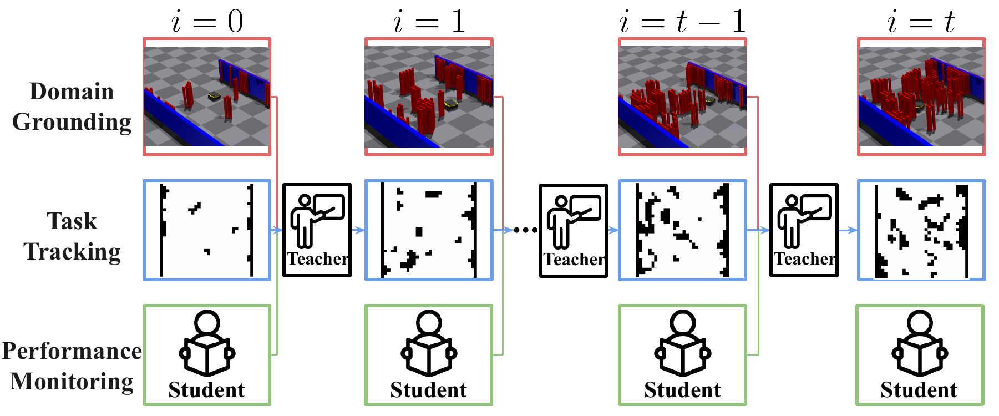
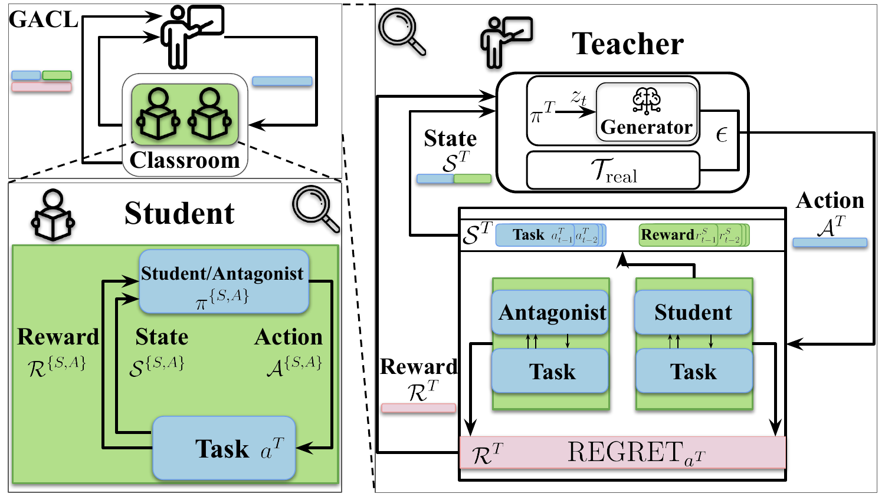
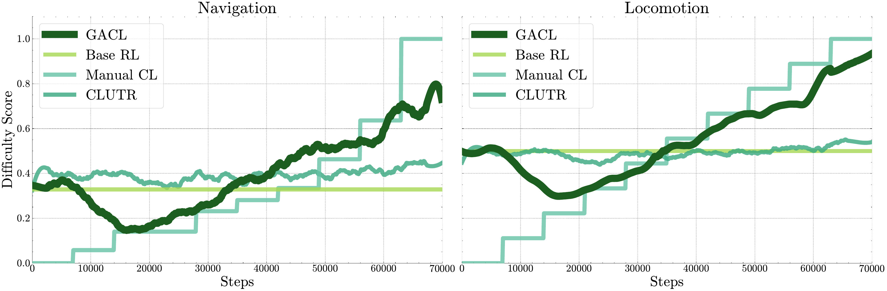

# Grounded Adaptive Curriculum Learning (GACL)

GACL is an open-source plug-in module designed to advance curriculum learning in complex robotic tasks. Our framework addresses the limitations of manually designed curricula by providing an automated, adaptive solution that scales to the demands of real-world robotics.

  

## Overview

Curriculum learning has emerged as a promising approach for training complex robotics tasks, yet existing methods often rely on hand-crafted curricula that require extensive engineering and may suffer from subjective, suboptimal choices. GACL introduces three key innovations:

- **Task Representation:** A robust method to consistently handle the design of complex robot tasks.
- **Active Performance Tracking:** An adaptive mechanism that tailors curriculum generation to the robot’s current capabilities.
- **Grounding Mechanism:** An approach that alternates between reference and synthetic tasks, ensuring relevance to target domain distributions.

  

## Features

- **Plug-in Module:** Seamlessly integrate GACL with your existing robotics frameworks.
- **Open Source:** We are committed to transparency and collaboration in the robotics community.
- **Adaptive Curriculum Learning:** Automatically generate curricula that evolve with the robot’s performance.
- **Scalability:** Efficiently manage complex task spaces with minimal manual intervention.
- **Grounded Relevance:** Maintain alignment with real-world task distributions.

## Results
Our experiments demonstrate that GACL significantly improves learning efficiency and performance in complex robotic tasks:

  

  

